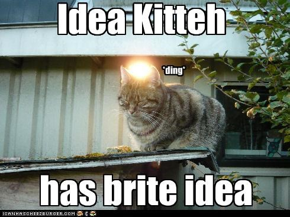

# Docker Images & Secrets

---

 - Secrets nötig zur Laufzeit (z.B. in k8s)
   - zur Laufzeit im Container verfügbar
   - Environment Variablen
   - Datei in speziellem mount Pfad

---

- Secrets nötig beim Build von Images
   - NPM Token für private packages
   - Auth-Tokens für geschützte Downloads
   - ...

---

---
#### Datei mit Secret kopieren & löschen

<pre><code data-trim data-noescape class="dockerfile">
FROM node:18-alpine

RUN apk add --no-cache tini
WORKDIR /app
ENV NODE_ENV=production

COPY package*.json ./
COPY geheim.txt .
RUN npm ci --omit=dev
RUN rm geheim.txt

EXPOSE 8080
COPY hello_world.js .

USER node
CMD /sbin/tini -- node hello_world.js
</code></pre>

<pre><code data-trim data-noescape class="shell">
docker build -t hello:latest -f Dockerfile-copy .

docker run -ti --rm -p8080:8080 --name hello hello:latest

docker exec -ti hello /bin/sh
</code></pre>

---

#### Image/container layered file system

---

#### Image Layer inspizieren
<pre><code data-trim data-noescape class="shell">
docker inspect hello:latest

docker save hello:latest -o layers.tar

tar xvf layers.tar

for layer in */layer.tar; do \
  tar -tf $layer | grep geheim.txt && echo $layer; \
done

tar xvf layer.tar
</code></pre>

---

#### Tool: Dive

https://github.com/wagoodman/dive

---

#### Secret als Build Argument übergeben

<pre><code data-trim data-noescape class="dockerfile">
FROM node:18-alpine

RUN apk add --no-cache tini
WORKDIR /app
ENV NODE_ENV=production

ARG NPM_TOKEN

COPY package*.json ./
COPY geheim.txt .
RUN npm ci --omit=dev
RUN rm geheim.txt

EXPOSE 8080
COPY hello_world.js .

USER node
CMD /sbin/tini -- node hello_world.js
</code></pre>

<pre><code data-trim data-noescape class="shell">
docker build -t hello:latest \
  --build-arg NPM_TOKEN=supageheim \
  -f Dockerfile-arg .
</code></pre>

---

#### Image inspizieren

<pre><code data-trim data-noescape class="shell">
docker inspect hello:latest

docker history hello:latest

dive hello:latest
</code></pre>

---

---
#### Docker Multistage Build
<pre><code data-trim data-noescape class="dockerfile">
FROM node:18-alpine AS hellobuild
WORKDIR /app
ENV NODE_ENV=production
ARG NPM_TOKEN
COPY package*.json ./
COPY geheim.txt .
RUN npm ci --omit=dev
RUN rm geheim.txt

FROM node:18-alpine
RUN apk add --no-cache tini
WORKDIR /app
ENV NODE_ENV=production
EXPOSE 8080
COPY --from=hellobuild /app/node_modules ./node_modules
COPY hello_world.js .
USER node
CMD /sbin/tini -- node hello_world.js
</code></pre>

<pre><code data-trim data-noescape class="shell">
docker build -t hello:latest \
  --build-arg NPM_TOKEN=supageheim \
  -f Dockerfile-arg .
</code></pre>
---
#### Docker Buildkit (Docker >= 18.09)

<pre><code data-trim data-noescape class="dockerfile">
# syntax = docker/dockerfile:1.2
FROM node:18-alpine

RUN apk add --no-cache tini
WORKDIR /app
ENV NODE_ENV=production

ARG NPM_TOKEN

COPY package*.json ./
RUN --mount=type=secret,id=geheim,dst=geheim.txt ls -al && npm ci --omit=dev
EXPOSE 8080
COPY hello_world.js .

USER node
CMD /sbin/tini -- node hello_world.js
</code></pre>

<pre><code data-trim data-noescape class="shell">
DOCKER_BUILDKIT=1 docker build -t hello:latest \
  --progress=plain --secret id=geheim,src=geheim.txt \
  -f Dockerfile-buildkit .
</code></pre>

---

#### Lösungsmöglichkeiten:

- [Docker Multi Stage Builds](https://docs.docker.com/build/building/multi-stage/)
- [Docker Buildkit](https://docs.docker.com/develop/develop-images/build_enhancements/)

---

Beispiele: https://github.com/seligerit/slides-docker-secrets/tree/main/docker-examples

Slides: https://seligerit.github.io/slides-docker-secrets/